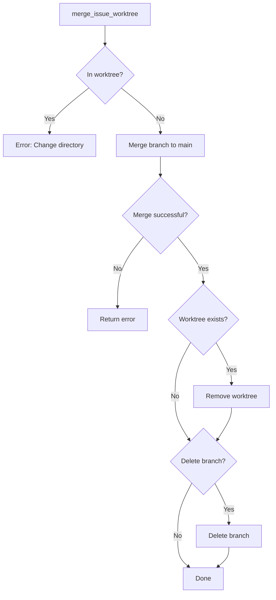

# Merge Worktree Operation

## Overview
Implement the `merge_issue_worktree` method that handles merging an issue branch and cleaning up its worktree. This replaces the current merge operation with worktree-aware functionality.

## Implementation

### Add merge_issue_worktree Method (`src/git.rs`)

```rust
impl GitOperations {
    /// Merge an issue worktree back to main and clean up
    pub fn merge_issue_worktree(&self, issue_name: &str, delete_branch: bool) -> Result<()> {
        let branch_name = format!("issue/{issue_name}");
        let worktree_path = self.get_worktree_path(issue_name);
        
        // First, ensure we're not currently in the worktree we're about to remove
        let cwd = std::env::current_dir()
            .context("Failed to get current directory")?;
        if cwd.starts_with(&worktree_path) {
            return Err(SwissArmyHammerError::Other(
                "Cannot merge worktree while inside it. Please change to main repository first.".to_string()
            ));
        }
        
        // Merge the branch (reuse existing logic)
        self.merge_issue_branch(issue_name)?;
        
        // Clean up the worktree if it exists
        if worktree_path.exists() && self.worktree_exists(&worktree_path)? {
            self.cleanup_worktree(&worktree_path)?;
        }
        
        // Delete branch if requested
        if delete_branch {
            self.delete_branch(&branch_name)?;
        }
        
        Ok(())
    }
    
    /// Clean up a worktree
    fn cleanup_worktree(&self, worktree_path: &Path) -> Result<()> {
        // First remove the git worktree
        self.remove_worktree(worktree_path)?;
        
        // Then clean up the directory if it still exists
        if worktree_path.exists() {
            std::fs::remove_dir_all(worktree_path)
                .with_context(|| format!("Failed to remove worktree directory: {:?}", worktree_path))?;
        }
        
        Ok(())
    }
    
    /// Force cleanup of orphaned worktrees
    pub fn cleanup_orphaned_worktrees(&self) -> Result<Vec<String>> {
        let mut cleaned = Vec::new();
        let worktrees = self.list_worktrees()?;
        
        for worktree in worktrees {
            // Check if worktree is in our managed directory
            if worktree.path.starts_with(self.get_worktree_base_dir()) {
                // Check if the worktree is orphaned (no branch)
                if worktree.branch.is_none() {
                    match self.cleanup_worktree(&worktree.path) {
                        Ok(_) => {
                            cleaned.push(worktree.path.display().to_string());
                        }
                        Err(e) => {
                            tracing::warn!("Failed to clean up orphaned worktree {:?}: {}", worktree.path, e);
                        }
                    }
                }
            }
        }
        
        Ok(cleaned)
    }
}
```

### Safety Checks

Add validation to prevent common issues:

```rust
impl GitOperations {
    /// Validate worktree operation is safe
    fn validate_worktree_operation(&self, worktree_path: &Path) -> Result<()> {
        // Check for uncommitted changes in worktree
        let status_output = Command::new("git")
            .current_dir(worktree_path)
            .args(["status", "--porcelain"])
            .output()?;
            
        if !status_output.status.success() {
            return Ok(()); // If we can't check, proceed anyway
        }
        
        let status = String::from_utf8_lossy(&status_output.stdout);
        if !status.trim().is_empty() {
            return Err(SwissArmyHammerError::Other(
                "Worktree has uncommitted changes. Please commit or stash them first.".to_string()
            ));
        }
        
        Ok(())
    }
}
```

## Mermaid Diagram



## Dependencies
- Requires WORKTREE_000210 (git worktree commands)
- Requires WORKTREE_000211 (create worktree operation)

## Testing
1. Test successful merge and cleanup
2. Test error when merging from inside worktree
3. Test branch deletion option
4. Test orphaned worktree cleanup
5. Test with uncommitted changes

## Context
This step implements the merge operation with worktree cleanup. It maintains backward compatibility by reusing the existing merge logic while adding worktree-specific handling.