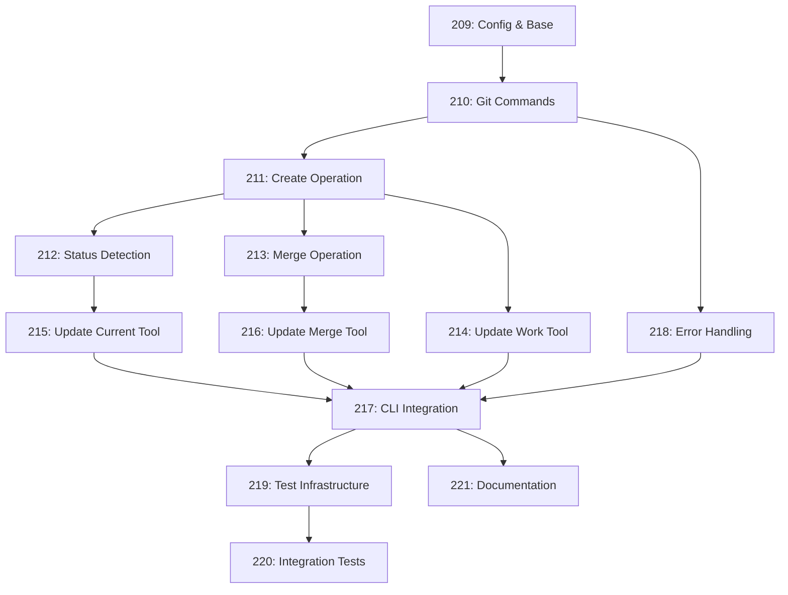

# Worktree Implementation Summary

## Overview
This is a summary of all the steps required to implement worktree-based issue management for Swiss Army Hammer. The implementation is broken down into 13 incremental steps that build on each other.

## Implementation Steps

### Foundation (Steps 1-3)
1. **WORKTREE_000209_config-and-base.md** - Add configuration and base infrastructure
2. **WORKTREE_000210_git-worktree-commands.md** - Add basic git worktree command wrappers
3. **WORKTREE_000211_create-worktree-operation.md** - Implement create_work_worktree method

### Core Operations (Steps 4-6)
4. **WORKTREE_000212_worktree-status-detection.md** - Add worktree detection methods
5. **WORKTREE_000213_merge-worktree-operation.md** - Implement merge with worktree cleanup
6. **WORKTREE_000218_error-handling.md** - Add robust error handling and recovery

### Tool Updates (Steps 7-9)
7. **WORKTREE_000214_update-work-tool.md** - Update work issue tool for worktrees
8. **WORKTREE_000215_update-current-tool.md** - Update current issue tool for worktree detection
9. **WORKTREE_000216_update-merge-tool.md** - Update merge tool for worktree cleanup

### Integration (Step 10)
10. **WORKTREE_000217_cli-integration.md** - Update CLI commands for worktree support

### Testing (Steps 11-12)
11. **WORKTREE_000219_test-infrastructure.md** - Add test utilities and helpers
12. **WORKTREE_000220_integration-tests.md** - Add comprehensive integration tests

### Documentation (Step 13)
13. **WORKTREE_000221_documentation.md** - Update all documentation for worktree workflow

## Implementation Order

The steps should be implemented in numerical order as each builds on the previous ones:

## Key Benefits

1. **Isolation**: Each issue has its own complete workspace
2. **Parallel Work**: Multiple issues can be worked on simultaneously
3. **Clean State**: No need to stash/commit when switching issues
4. **Simplified Workflow**: No branch switching in main repository

## Testing Strategy

- Unit tests for each git operation
- Integration tests for complete workflows
- Error recovery tests
- Cross-platform compatibility tests
- Performance tests with multiple worktrees

## Migration Notes

- The implementation maintains backward compatibility
- Existing branches can be converted to worktrees on first use
- No breaking changes to the API

This completes the planning phase for the worktree implementation.