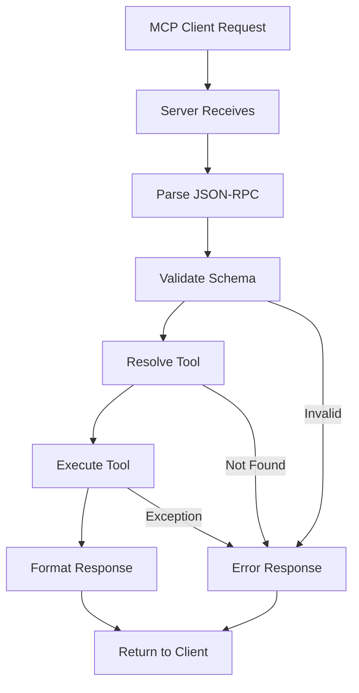
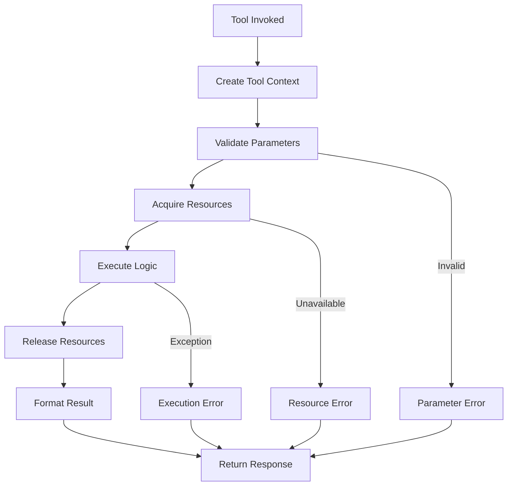
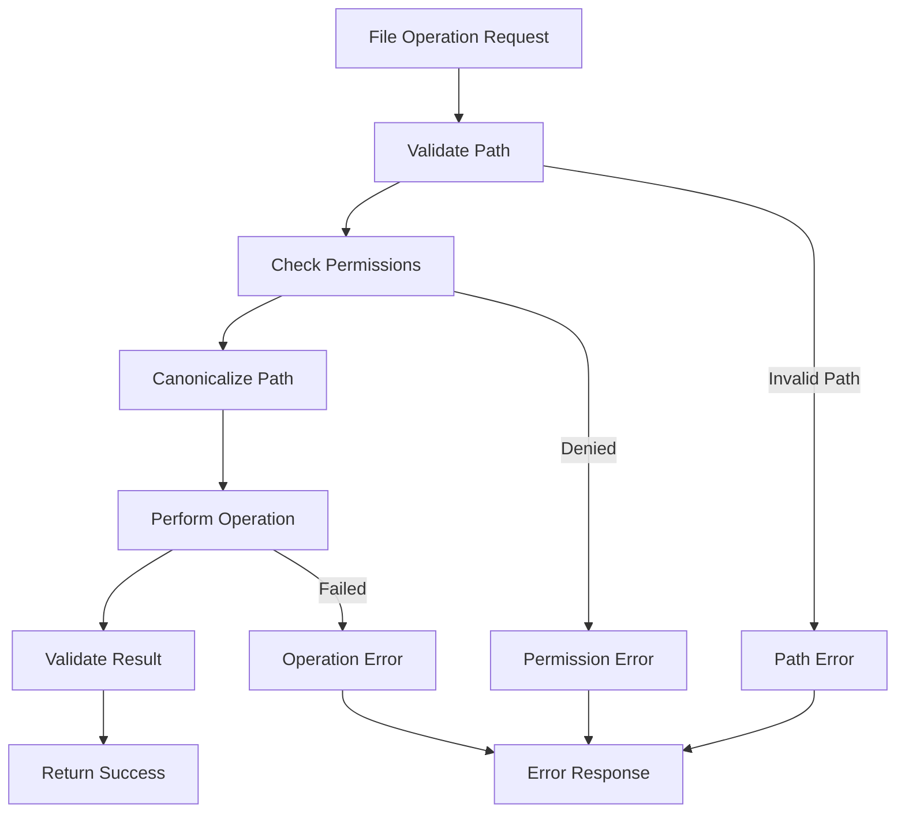

# Architecture Overview

SwissArmyHammer Tools is designed as a modular, extensible MCP server with clear separation of concerns and a pluggable architecture.

## System Architecture

```
┌──────────────────────────────────────────────────────────────┐
│                       AI Clients                             │
│         (Claude Code, Custom Applications)                   │
└──────────────────────┬───────────────────────────────────────┘
                       │ MCP Protocol
                       │ (stdio or HTTP)
┌──────────────────────┴───────────────────────────────────────┐
│                    MCP Server                                │
│              (swissarmyhammer-tools)                         │
├──────────────────────────────────────────────────────────────┤
│  ┌────────────────┐  ┌─────────────┐  ┌──────────────────┐  │
│  │ Request Handler│  │Tool Registry│  │  Error Manager   │  │
│  │   (rmcp)       │  │  (Dynamic)  │  │  (Structured)    │  │
│  └────────────────┘  └─────────────┘  └──────────────────┘  │
└──────────────────────┬───────────────────────────────────────┘
                       │
         ┌─────────────┼─────────────────────┐
         │             │                     │
┌────────┴─────┐  ┌────┴──────┐  ┌─────────┴────────┐
│ Domain Crates│  │   Tools   │  │  Prompt Library  │
│ (Issues, Git,│  │ (28 tools)│  │   (Templates)    │
│ Search, etc.)│  │           │  │                  │
└──────────────┘  └───────────┘  └──────────────────┘
```

## Core Components

### MCP Server

The MCP server is the central component that:
- Implements the Model Context Protocol specification
- Manages tool registration and discovery
- Handles request routing and response formatting
- Provides both stdio and HTTP transport modes
- Ensures type safety through JSON schema validation

**Key files:**
- `src/mcp/server.rs:1` - Main server implementation
- `src/mcp/unified_server.rs:1` - Unified stdio/HTTP server
- `src/mcp/tool_registry.rs:1` - Tool registration system

### Tool Registry

The tool registry provides dynamic tool management:
- Tools self-register on startup
- Each tool implements the `McpTool` trait
- Tools are organized by category
- Schema validation for parameters
- Async execution model

**Registration pattern:**
```rust
pub fn register_file_tools(registry: &mut ToolRegistry) {
    registry.register(Box::new(FilesRead));
    registry.register(Box::new(FilesWrite));
    registry.register(Box::new(FilesEdit));
    // ... more tools
}
```

### Tool Context

Provides shared access to resources:
- Prompt library for workflow templates
- Working directory management
- Storage backend access
- Configuration settings

**Key type:**
```rust
pub struct ToolContext {
    pub library: PromptLibrary,
    pub working_directory: PathBuf,
    // ... other shared resources
}
```

## Domain Crates

SwissArmyHammer follows a domain-driven design with separate crates for each major feature area:

### swissarmyhammer-issues
Issue tracking with git integration
- Create, update, complete issues
- Markdown file storage
- Automatic git branch management
- Lifecycle tracking

### swissarmyhammer-search
Semantic code search
- Vector embeddings using nomic-embed-code
- Tree-sitter parsing for multiple languages
- DuckDB vector storage
- Incremental indexing

### swissarmyhammer-git
Git operations and integration
- File change tracking
- Branch detection
- Parent branch identification
- Status reporting

### swissarmyhammer-memoranda
Note-taking and knowledge management
- ULID-based identification
- Full-text search capabilities
- Project and user-level storage
- Context aggregation

### swissarmyhammer-todo
Ephemeral task tracking
- Session-based task lists
- ULID identification
- Automatic cleanup on completion
- Next-task retrieval

### swissarmyhammer-outline
Code structure analysis
- Tree-sitter based parsing
- Symbol extraction (classes, functions, methods)
- Multi-language support
- YAML/JSON output formats

### swissarmyhammer-rules
Code quality checks
- Pattern-based rule definitions
- Severity levels (error, warning, info, hint)
- Category filtering
- Change-aware checking

### swissarmyhammer-shell
Shell command execution
- Environment variable support
- Working directory control
- Output capture (stdout/stderr)
- Timeout handling

### swissarmyhammer-workflow
Workflow orchestration
- State machine execution
- AI agent coordination
- Progress notifications
- Error recovery

### swissarmyhammer-agent-executor
AI agent task execution
- Agent lifecycle management
- Context passing
- Result aggregation

## Data Flow

### Request Processing



### Tool Execution



### File Operations



## Tool Categories

### Files (`files_*`)
- `files_read`: Read file contents with partial reading support
- `files_write`: Atomic file writes with encoding preservation
- `files_edit`: Precise string replacement editing
- `files_glob`: Pattern-based file discovery
- `files_grep`: Content-based search with ripgrep

### Search (`search_*`)
- `search_index`: Index files for semantic search
- `search_query`: Query indexed code semantically

### Issues (`issue_*`)
- `issue_create`: Create new work items
- `issue_list`: List issues with filtering
- `issue_show`: Display issue details
- `issue_update`: Update issue content
- `issue_mark_complete`: Complete and archive issues
- `issue_all_complete`: Check completion status

### Memos (`memo_*`)
- `memo_create`: Create notes with ULID
- `memo_get`: Retrieve specific memo
- `memo_list`: List all memos
- `memo_get_all_context`: Get aggregated context

### Todos (`todo_*`)
- `todo_create`: Create task items
- `todo_show`: Show specific or next todo
- `todo_mark_complete`: Complete tasks

### Git (`git_*`)
- `git_changes`: List changed files on branch

### Shell (`shell_*`)
- `shell_execute`: Execute shell commands

### Outline (`outline_*`)
- `outline_generate`: Generate code structure outlines

### Rules (`rules_*`)
- `rules_check`: Check code against quality rules

### Web (`web_*`)
- `web_fetch`: Fetch and convert web content
- `web_search`: DuckDuckGo search integration

### Flow (`flow`)
- `flow`: Execute workflows with AI coordination

### Abort (`abort_*`)
- `abort_create`: Signal workflow termination

## Design Principles

### Modularity
Each tool is self-contained with minimal dependencies. Tools can be added, removed, or modified without affecting others.

### Type Safety
Full JSON schema validation ensures type safety at the MCP protocol boundary. Rust's type system provides compile-time guarantees.

### Error Handling
Comprehensive error types with context propagation. Errors are structured and machine-readable for AI clients.

### Security
All file operations validate paths and check permissions. Configurable limits prevent resource exhaustion.

### Extensibility
New tools can be added by implementing the `McpTool` trait and registering with the tool registry.

### Async First
All I/O operations are async using Tokio runtime for efficient concurrency.

## Integration Points

### MCP Protocol
SwissArmyHammer implements the full MCP specification:
- JSON-RPC 2.0 message format
- Tool discovery via `tools/list`
- Tool execution via `tools/call`
- Error reporting with structured types

### Prompt Library Integration
Tools integrate with the SwissArmyHammer prompt library for workflow templates and system prompts.

### Storage Backends
Pluggable storage for issues, memos, and search indices:
- File system for issues and memos
- DuckDB for semantic search
- Git for version control

## Testing Architecture

### Unit Tests
Each tool has comprehensive unit tests covering:
- Parameter validation
- Success cases
- Error conditions
- Edge cases

### Integration Tests
End-to-end tests validate:
- Tool registration
- Request/response flow
- Storage operations
- Git integration

### Test Utilities
Shared test infrastructure:
- Mock file systems
- Temporary git repositories
- Test fixtures

**Key files:**
- `src/test_utils.rs:1` - Shared test utilities
- `src/mcp/tests.rs:1` - MCP server tests
- `src/test_utils/git_test_helpers.rs:1` - Git testing helpers

## Performance Characteristics

### Memory Usage
- Base server: ~10-20MB
- With search index: +50-200MB (depends on codebase size)
- Per-tool overhead: ~1-5MB during execution

### Latency
- Tool invocation overhead: ~1-5ms
- File operations: ~5-50ms (depends on file size)
- Semantic search (first query): ~1-3s (model loading)
- Semantic search (subsequent): ~50-300ms

### Concurrency
- Supports concurrent tool execution
- Configurable concurrency limits
- Async I/O throughout for non-blocking operations

## Security Model

### Path Validation
- All paths are canonicalized and validated
- Directory traversal prevention
- Symlink resolution with safeguards

### Resource Limits
- Maximum file sizes
- Search result limits
- Command execution timeouts

### Permission Checks
- File read/write permissions validated
- Git operations sandboxed to working directory
- Shell commands subject to allowed/denied lists

## Next Steps

- **[MCP Server Design](architecture/mcp-server.md)**: Deep dive into server implementation
- **[Tool Registry](architecture/tool-registry.md)**: How tools are registered and managed
- **[Component Relationships](architecture/components.md)**: Detailed component interactions
- **[Features](features.md)**: Explore individual tool capabilities
