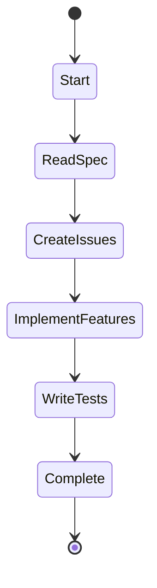

# Storage Backends

SwissArmyHammer uses file-based storage with trait abstractions to provide flexible, version-controllable data persistence. All storage backends use markdown or YAML formats for human-readable data that integrates seamlessly with git workflows.

## Storage Philosophy

### Design Principles

1. **Human-Readable**: All data stored as markdown or YAML
2. **Version-Controllable**: Data files work with git
3. **No Lock-In**: Standard formats, no proprietary databases
4. **Git-Native**: Automatic repository detection
5. **Flexible Paths**: Support for custom locations

### Storage Locations

Default storage locations are discovered automatically:

```
.swissarmyhammer/
├── issues/           # Issue tracking
│   ├── FEATURE_001_auth.md
│   ├── BUG_002_crash.md
│   └── complete/     # Completed issues
├── memos/            # Knowledge management
│   ├── 01HXXX_meeting-notes.md
│   └── 01HYYY_design-decisions.md
└── workflows/        # Development workflows
    ├── implement.yaml
    └── review.yaml
```

## Issue Storage

The `IssueStorage` trait provides issue tracking functionality with markdown-based persistence.

### IssueStorage Trait

```rust
#[async_trait]
pub trait IssueStorage: Send + Sync {
    async fn create(&mut self, issue: Issue) -> Result<Issue>;
    async fn get(&self, name: &str) -> Result<Option<Issue>>;
    async fn list(&self, include_completed: bool) -> Result<Vec<IssueMetadata>>;
    async fn update(&mut self, name: &str, content: &str) -> Result<()>;
    async fn mark_complete(&mut self, name: &str) -> Result<()>;
    fn get_directory(&self) -> &Path;
}
```

### FileSystemIssueStorage

Implementation using filesystem with markdown files:

```rust
pub struct FileSystemIssueStorage {
    directory: PathBuf,
    complete_directory: PathBuf,
}

impl FileSystemIssueStorage {
    pub fn new(directory: PathBuf) -> Result<Self>;
    pub fn new_default() -> Result<Self>;
}
```

#### Default Location Discovery

```rust
// 1. Check if in git repository
if let Ok(repo_root) = find_git_root() {
    return Ok(repo_root.join(".swissarmyhammer/issues"));
}

// 2. Fall back to current directory
Ok(PathBuf::from(".swissarmyhammer/issues"))
```

### Issue File Format

Issues are stored as markdown files with frontmatter:

```markdown
---
name: FEATURE_001_user-authentication
type: feature
priority: high
status: active
created: 2024-01-15T10:30:00Z
---

# User Authentication System

Implement a secure user authentication system with:

- Email/password login
- OAuth2 integration (Google, GitHub)
- JWT token management
- Password reset functionality

## Acceptance Criteria

- [ ] Users can register with email/password
- [ ] Users can log in with OAuth2
- [ ] Tokens expire after 24 hours
- [ ] Password reset sends email

## Technical Notes

Use the `jsonwebtoken` crate for JWT handling.
```

### Issue Lifecycle

```
create() → Active Issue (in issues/)
   ↓
update() → Modified Issue (in place)
   ↓
mark_complete() → Completed Issue (moved to issues/complete/)
```

### Usage Example

```rust
let mut storage = FileSystemIssueStorage::new_default()?;

// Create a new issue
let issue = Issue::new("FEATURE_001_auth", "# Authentication\n\nImplement auth...");
let created = storage.create(issue).await?;

// List active issues
let issues = storage.list(false).await?;

// Mark complete
storage.mark_complete("FEATURE_001_auth").await?;
```

## Memo Storage

The `MemoStorage` trait provides note-taking and knowledge management with ULID-based identification.

### MemoStorage Trait

```rust
#[async_trait]
pub trait MemoStorage: Send + Sync {
    async fn create_memo(&mut self, title: String, content: String) -> Result<Memo>;
    async fn get_memo(&self, title: &str) -> Result<Option<Memo>>;
    async fn list_memos(&self) -> Result<Vec<MemoMetadata>>;
    async fn get_all_context(&self) -> Result<String>;
}
```

### MarkdownMemoStorage

Implementation using markdown files with ULID identifiers:

```rust
pub struct MarkdownMemoStorage {
    directory: PathBuf,
}

impl MarkdownMemoStorage {
    pub fn new(directory: PathBuf) -> Self;
    pub async fn new_default() -> Result<Self>;
}
```

#### Default Location Discovery

```rust
// 1. Check SWISSARMYHAMMER_MEMOS_DIR environment variable
if let Ok(custom_path) = std::env::var("SWISSARMYHAMMER_MEMOS_DIR") {
    return Ok(PathBuf::from(custom_path));
}

// 2. Find git root and use .swissarmyhammer/memos
if let Ok(repo_root) = find_git_root().await {
    return Ok(repo_root.join(".swissarmyhammer/memos"));
}

// 3. Fall back to current directory
Ok(PathBuf::from(".swissarmyhammer/memos"))
```

### Memo File Format

Memos use ULID-based filenames for sortable, unique identifiers:

```
01HXXX1234567890ABCDEFGHJ_meeting-notes.md
├─ ULID (sortable timestamp + random)
└─ Slug from title
```

File content:

```markdown
# Team Meeting Notes

Date: 2024-01-15

## Attendees
- Alice
- Bob
- Carol

## Decisions
1. Move to microservices architecture
2. Adopt Rust for backend services
3. Use SwissArmyHammer for development

## Action Items
- [ ] Create architecture diagram
- [ ] Set up CI/CD pipeline
- [ ] Schedule training sessions
```

### Memo Features

#### Chronological Sorting

ULIDs ensure memos sort chronologically:

```rust
let memos = storage.list_memos().await?;
// Automatically sorted by creation time (oldest first)
```

#### Context Aggregation

Get all memo content for AI context:

```rust
let context = storage.get_all_context().await?;
// Returns all memos concatenated, most recent first
```

### Usage Example

```rust
let mut storage = MarkdownMemoStorage::new_default().await?;

// Create a memo
let memo = storage.create_memo(
    "Design Decisions".to_string(),
    "# Architecture\n\nWe decided to use...".to_string()
).await?;

// Retrieve a memo
let memo = storage.get_memo("Design Decisions").await?;

// List all memos
let memos = storage.list_memos().await?;

// Get all content for AI
let context = storage.get_all_context().await?;
```

## Workflow Storage

Workflows are stored as YAML files defining development processes.

### Workflow File Format

```yaml
---
name: implement
title: Implementation Workflow
description: Implement features from specifications
arguments:
  - name: spec_file
    description: Path to specification file
    default: "spec.md"
---

# Implementation Workflow



## Actions

- Start: Log "Starting implementation from ${spec_file}"
- ReadSpec: Read specification file and parse requirements
- CreateIssues: Create issues for each feature
- ImplementFeatures: Execute prompt "implement-feature" for each issue
- WriteTests: Execute prompt "write-tests" for each feature
- Complete: Log "Implementation complete"
```

### Workflow Discovery

Workflows are discovered from multiple locations:

1. Bundled workflows in swissarmyhammer-workflow crate
2. Global workflows in `~/.swissarmyhammer/workflows`
3. Project-local workflows in `.swissarmyhammer/workflows`

## Storage Configuration

### Environment Variables

```bash
# Custom memo storage location
export SWISSARMYHAMMER_MEMOS_DIR=/path/to/memos

# Enable CLI mode (affects default paths)
export SAH_CLI_MODE=1
```

### Configuration File

`sah.yaml` or `~/.config/swissarmyhammer/sah.yaml`:

```yaml
issues:
  directory: ".swissarmyhammer/issues"
  
memos:
  directory: ".swissarmyhammer/memos"
  
workflows:
  directory: ".swissarmyhammer/workflows"
```

## Storage Operations

### Atomic Operations

All storage backends ensure atomic operations:

1. **Write-then-Move**: Write to temporary file, then atomic rename
2. **Read-Modify-Write**: Use file locks for concurrent access
3. **Error Recovery**: Automatic cleanup of partial writes

### Example: Atomic Write

```rust
// 1. Write to temporary file
let temp_path = directory.join(format!("{}.tmp", filename));
fs::write(&temp_path, content).await?;

// 2. Atomic rename
fs::rename(&temp_path, &final_path).await?;

// 3. If error, cleanup is automatic (temp files cleaned on next operation)
```

### Concurrency

Storage backends use appropriate synchronization:

```rust
// Shared read access, exclusive write access
let storage: Arc<RwLock<Box<dyn IssueStorage>>> = ...;

// Multiple concurrent readers
let issue = storage.read().await.get("issue-name").await?;

// Exclusive writer
let mut storage_guard = storage.write().await;
storage_guard.create(issue).await?;
```

## Git Integration

Storage backends integrate with git workflows:

### Automatic Git Detection

```rust
pub fn find_git_root() -> Result<PathBuf> {
    let current = env::current_dir()?;
    let mut path = current.as_path();
    
    while let Some(parent) = path.parent() {
        if path.join(".git").exists() {
            return Ok(path.to_path_buf());
        }
        path = parent;
    }
    
    Err(Error::NotInGitRepo)
}
```

### Git-Friendly File Formats

- **Line-based**: Markdown for better diffs
- **Frontmatter**: Structured metadata in YAML
- **No Binary**: All data as UTF-8 text
- **Stable IDs**: ULIDs prevent merge conflicts

### Commit Integration

Storage backends support automatic git commits:

```rust
// After creating/updating issue
if let Some(git_ops) = context.git_ops.lock().await.as_ref() {
    git_ops.add(&issue_path)?;
    git_ops.commit(&format!("Create issue: {}", issue.name))?;
}
```

## Performance Considerations

### File System Operations

- **Lazy Loading**: Files read on demand, not at startup
- **Directory Caching**: Directory listings cached per operation
- **Parallel Processing**: Multiple files processed concurrently

### Memory Usage

- **Streaming**: Large files processed in chunks
- **Limited Caching**: Only active data in memory
- **Cleanup**: Temporary files cleaned periodically

### Scalability

Tested with:
- 1,000+ issues in single directory
- 10,000+ memos with fast lookup
- Concurrent access from multiple tools

## Testing

### Unit Tests

```rust
#[tokio::test]
async fn test_issue_lifecycle() {
    let temp_dir = tempdir()?;
    let mut storage = FileSystemIssueStorage::new(temp_dir.path().to_path_buf())?;
    
    // Create
    let issue = Issue::new("TEST_001", "# Test Issue");
    storage.create(issue).await?;
    
    // Read
    let loaded = storage.get("TEST_001").await?;
    assert!(loaded.is_some());
    
    // Complete
    storage.mark_complete("TEST_001").await?;
    let completed = storage.get("TEST_001").await?;
    assert!(completed.is_none());
}
```

### Integration Tests

```rust
#[tokio::test]
async fn test_storage_with_git() {
    let temp_dir = setup_git_repo()?;
    let mut storage = FileSystemIssueStorage::new_default()?;
    
    // Operations should work in git repo
    let issue = Issue::new("TEST_001", "# Test");
    storage.create(issue).await?;
    
    // File should be in git-ignored directory
    assert!(temp_dir.join(".swissarmyhammer/issues/TEST_001.md").exists());
}
```

## Best Practices

### For Users

1. **Commit Storage Files**: Include `.swissarmyhammer/` in version control
2. **Use .gitignore Carefully**: Don't ignore memos or issues
3. **Regular Backups**: Use git remote for backup
4. **Clean Completed Items**: Archive old completed issues

### For Developers

1. **Use Traits**: Code against trait, not implementation
2. **Handle Errors**: Storage operations can fail
3. **Test with Temp Dirs**: Use `tempfile` crate for tests
4. **Atomic Operations**: Ensure data consistency
5. **Respect Locks**: Use appropriate synchronization

## Troubleshooting

### Common Issues

**Problem**: Storage directory not found

**Solution**:
```bash
# Ensure directory exists
mkdir -p .swissarmyhammer/issues
mkdir -p .swissarmyhammer/memos

# Or let storage create it
# Storage backends create directories automatically
```

**Problem**: Permission denied

**Solution**:
```bash
# Fix permissions
chmod -R u+w .swissarmyhammer/

# Check ownership
ls -la .swissarmyhammer/
```

**Problem**: Git repository not detected

**Solution**:
```bash
# Initialize git if needed
git init

# Or use explicit path
export SWISSARMYHAMMER_MEMOS_DIR=/explicit/path
```

## Related Documentation

- [MCP Server](./mcp-server.md)
- [Tool Registry](./tool-registry.md)
- [Security Model](./security.md)
- [Configuration Reference](../reference/configuration.md)
